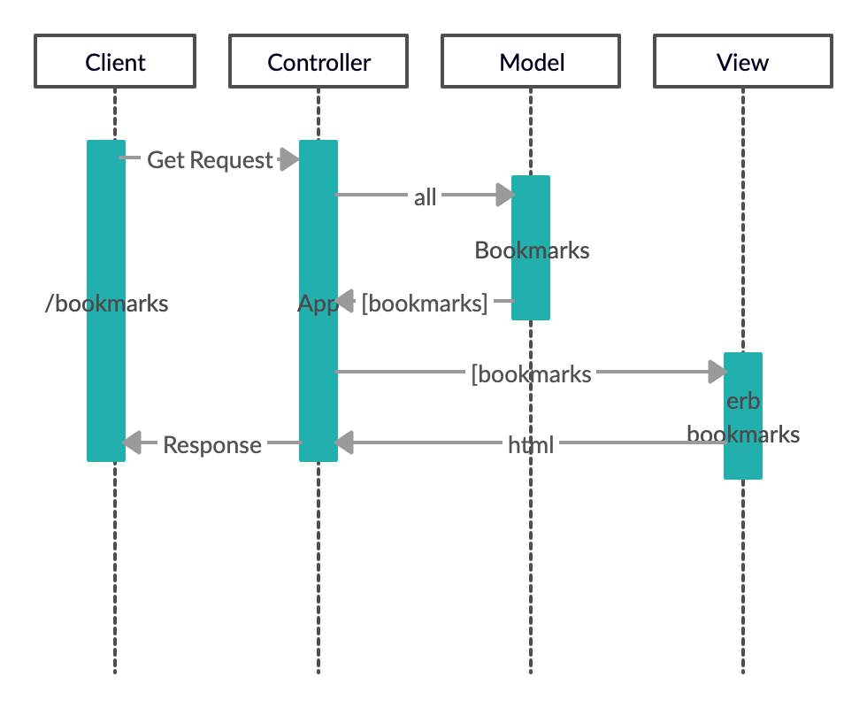

## README

## Bookmark Manager Project

The website will have the following specification:

Show a list of bookmarks
Add new bookmarks
Delete bookmarks
Update bookmarks
Comment on bookmarks
Tag bookmarks into categories
Filter bookmarks by tag
Users are restricted to manage only their own bookmarks

## User Stories

1. Show a list of Bookmarks

    As a User
    So that I may view my saved websites
    I would like to see a list of my bookmarks

2. Add new Bookmarks

    As a User
    So that I may save a new website
    I would like to be able a new bookmark

## Domain Model

## Database Setup

Anyone needing to setup the database from scratch will need to do the following things:

1. Connect to psql - `psql postgres`
2. Create the databases using the psql command `CREATE DATABASE'` to create the `bookmark_manager;` and `bookmark_manager_test;` databases.
3. Connect to the databases using the pqsl command `psql bookmark_manager;` and `psql bookmark_manager_test;`
4. Run the query we have saved in the file 01_create_bookmarks_table.sql in the given order